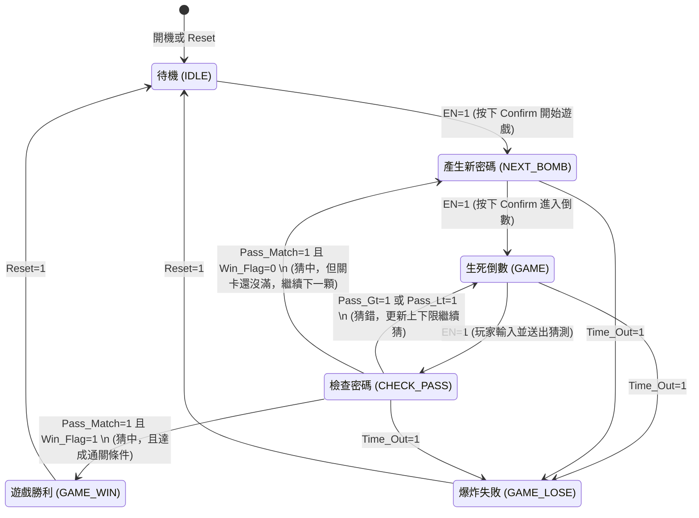

# 拆彈遊戲 狀態機圖 (State Diagram)

本圖為 `Ultimate_Bomb_controller` 的核心狀態機轉換圖。
您可以使用支援 Mermaid 的 Markdown 編輯器 (如 VSCode, Obsidian) 或貼到 [Mermaid Live Editor](https://mermaid.live/) 來預覽並匯出圖片。

### 狀態動作說明：
* **`IDLE`**：清除所有狀態 (`WIN`, `LOSE`, `Game_Run` = 0)，等待玩家選擇難度。
* **`NEXT_BOMB`**：發送 `New_Bomb` 脈衝，觸發 RNG 產生新目標密碼，並將 Min/Max 重置為 00 與 99。
* **`GAME`**：發送 `Game_Run` = 1，啟動外部的 1Hz 倒數計時器。
* **`CHECK_PASS`**：
  * 若大於/小於目標，發送 `Load_Max` 或 `Load_Min` 給暫存器。
  * 若等於目標，發送 `add_time` (加秒數) 與 `Next_Level` (關卡進度+1)。
* **`GAME_WIN`**：輸出 `WIN=1`，關閉計時器。
* **`GAME_LOSE`**：輸出 `LOSE=1`，關閉計時器。
